# Awesome-Transformer-Visualization

Explore visualization tools for understanding Transformer-based large language models (LLMs).

Ordered by publication date, from newest to oldest.

## Tilde

_Apply interpretability to unlock deep reasoning and control of models, enabling the next generation of human-AI interaction._

Tilde Research, 2024.11
[Thread](https://x.com/tilderesearch/status/1856404543808131334) /
[Website](https://www.tilderesearch.com/)

## Transluce

_Tools for understanding and steering AI systems, and insights derived from their use inform our research._

Transluce Team, 2024.10
[Demo](https://monitor.transluce.org/dashboard/) /
[GitHub](https://github.com/TransluceAI/observatory) /
[Website](https://transluce.org/)

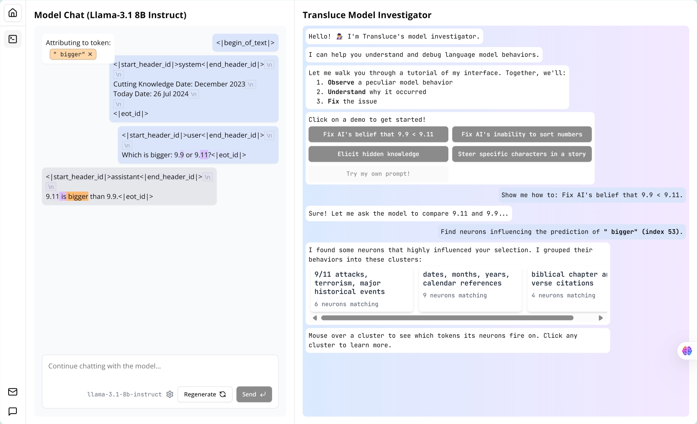

## AI by Hand (Excel)

_Learn several key components of DL models by using customized excels_

Tom Yeh, 2024.09
[GitHub](https://github.com/ImagineAILab/ai-by-hand-excel)

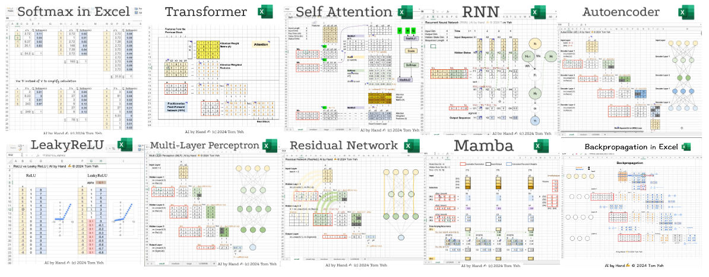

## Transformer Explainer

_Learn How Transformer Models Work with Interactive Visualization_

Georgia Tech and IBM, 2024.08
[Demo](https://poloclub.github.io/transformer-explainer/) /
[GitHub](https://github.com/poloclub/transformer-explainer) /
[arXiv](https://arxiv.org/abs/2408.04619)

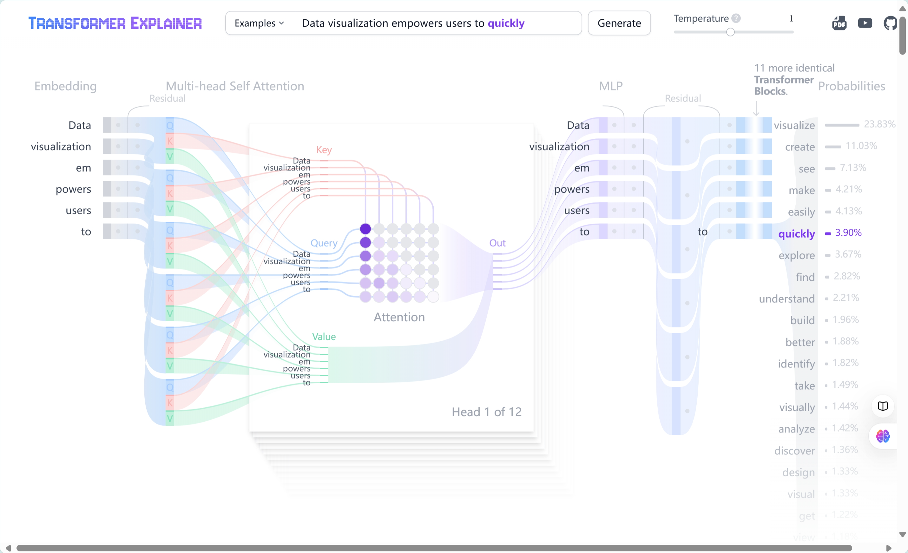

## Gemma Scope

_Help the safety community shed light on the inner workings of language models_

Google DeepMind, 2024.07
[Demo](https://www.neuronpedia.org/gemma-scope) /
[Blog](https://deepmind.google/discover/blog/gemma-scope-helping-the-safety-community-shed-light-on-the-inner-workings-of-language-models/) /
[PDF](https://storage.googleapis.com/gemma-scope/gemma-scope-report.pdf)

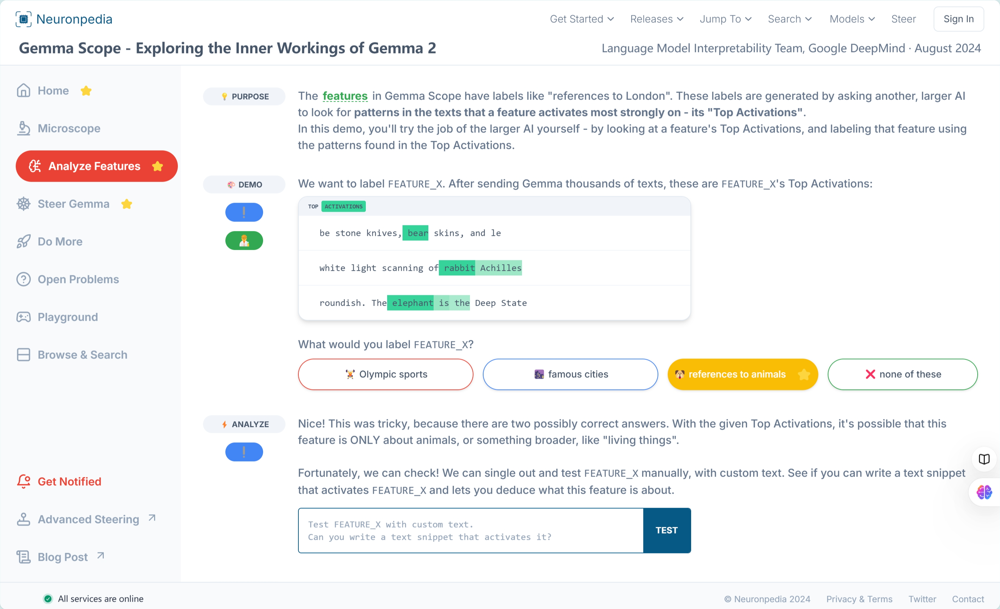

## Inspectus

_Inspectus is a versatile visualization tool for machine learning. It runs smoothly in Jupyter notebooks via an easy-to-use Python API._

labml.ai, 2024.06
[GitHub](https://github.com/labmlai/inspectus)

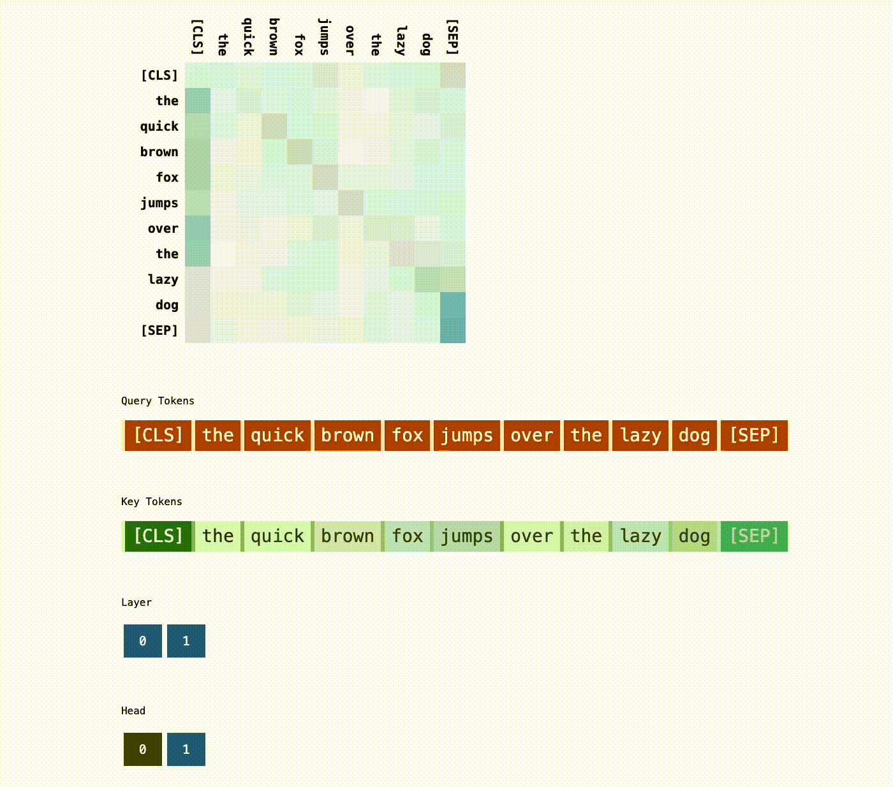

## SAE Viewer

_We used new scalable methods to decompose GPT-4’s internal representations into 16 million oft-interpretable patterns._

OpenAI, 2024.06
[Demo](https://openaipublic.blob.core.windows.net/sparse-autoencoder/sae-viewer/index.html#/) /
[GitHub](https://github.com/openai/sparse_autoencoder) /
[Blog](https://openai.com/index/extracting-concepts-from-gpt-4/) /
[arXiv](https://arxiv.org/abs/2406.04093)

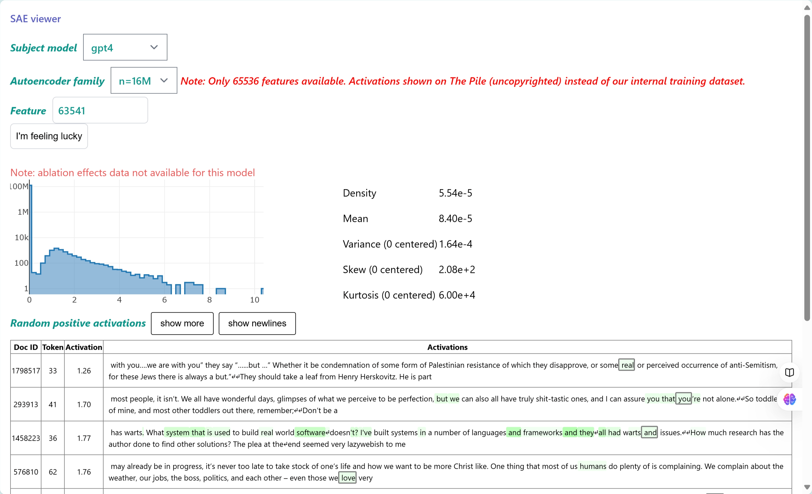

## LLM Transparency Tool

_An open-source interactive toolkit for analyzing internal workings of Transformer-based language models._

Meta, 2024.04
[Demo](https://huggingface.co/spaces/facebook/llm-transparency-tool-demo) /
[GitHub](https://github.com/facebookresearch/llm-transparency-tool) /
[arXiv](https://arxiv.org/abs/2404.07004)

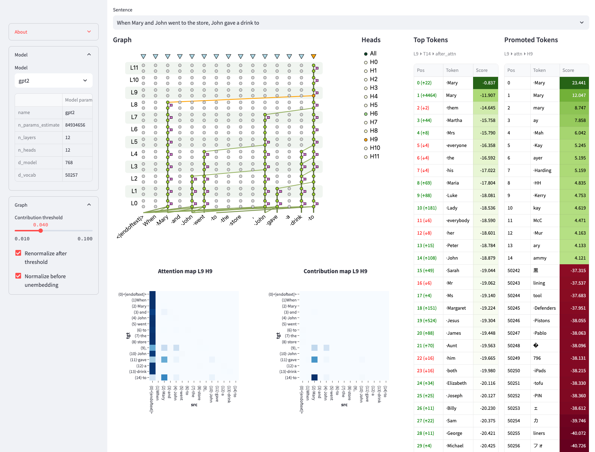

## Neuronpedia

_Neuronpedia is a platform for mechanistic interpretability research. Its goal is to accelerate researchers for Sparse Autoencoders (SAEs) by hosting models, feature dashboards, data visualizations, tooling, and more._

Johnny Lin and Joseph Bloom, 2024.03
[Demo](https://www.neuronpedia.org/)

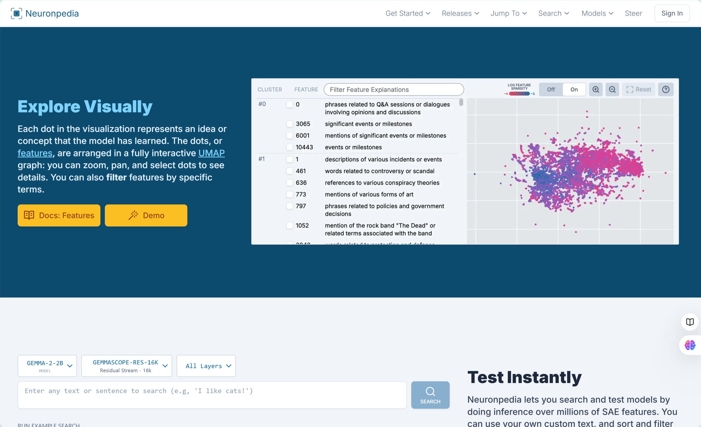

## CircuitsVis

_Mechanistic Interpretability visualizations, that work both in both Python (e.g. with Jupyter Lab) and JavaScript (e.g. React or plain HTML)._

Alan Cooney and Neel Nanda, 2023.10
[Demo](https://transformerlensorg.github.io/CircuitsVis/) /
[GitHub](https://github.com/TransformerLensOrg/CircuitsVis)

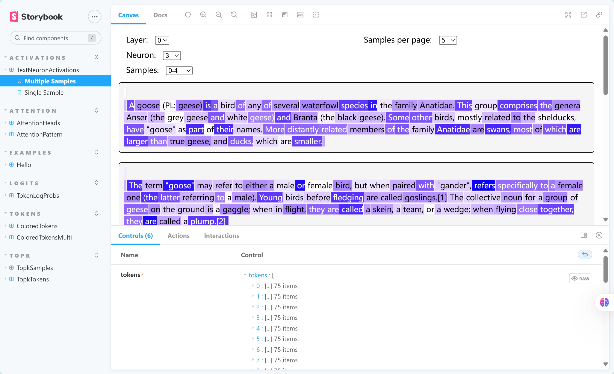

## LLM Visualization

_A visualization and walkthrough of the LLM algorithm that backs OpenAI's ChatGPT. Explore the algorithm down to every add & multiply, seeing the whole process in action._

Brendan Bycroft, 2023.05
[Demo](https://bbycroft.net/llm) /
[GitHub](https://github.com/bbycroft/llm-viz)

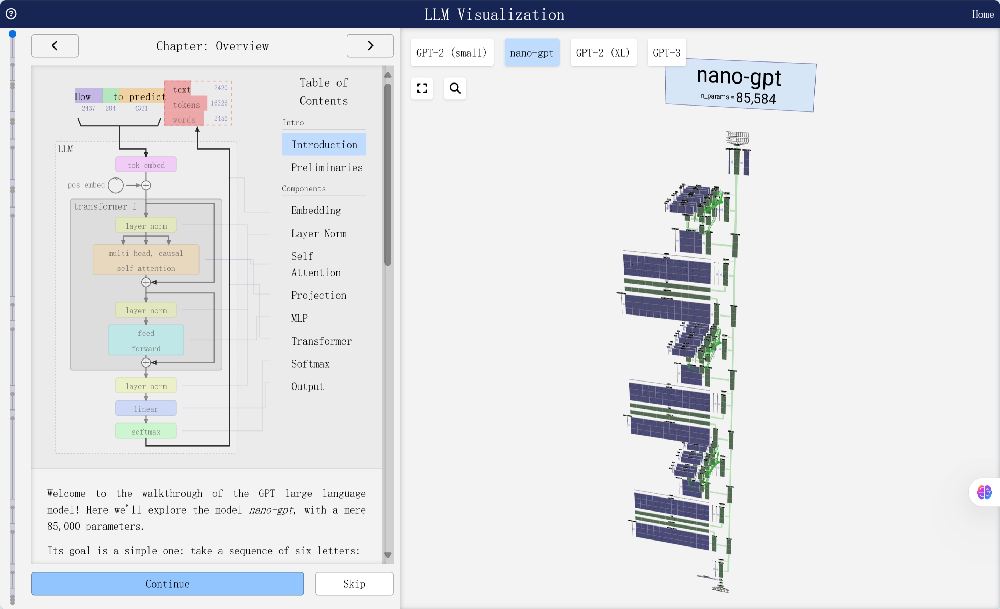

## TransformerLens

_A library for mechanistic interpretability of GPT-style language models_

Neel Nanda and Joseph Bloom, 2022.08
[GitHub](https://github.com/TransformerLensOrg/TransformerLens) /
[Distill](https://distill.pub/2020/circuits/zoom-in/) /
[Documentation](https://transformerlensorg.github.io/TransformerLens/)

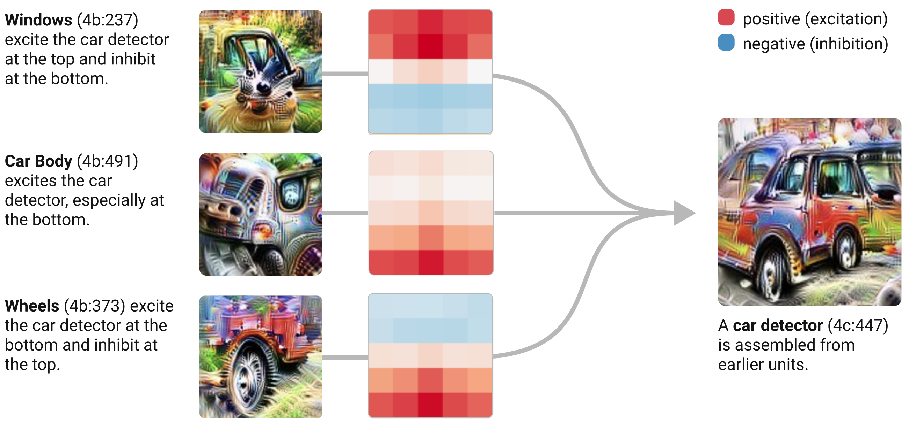

## BertViz

_Visualize Attention in NLP Models (BERT, GPT2, BART, etc.)_

Jesse Vig, 2019.07
[GitHub](https://github.com/jessevig/bertviz) /
[ACL Anthology](https://aclanthology.org/P19-3007/)

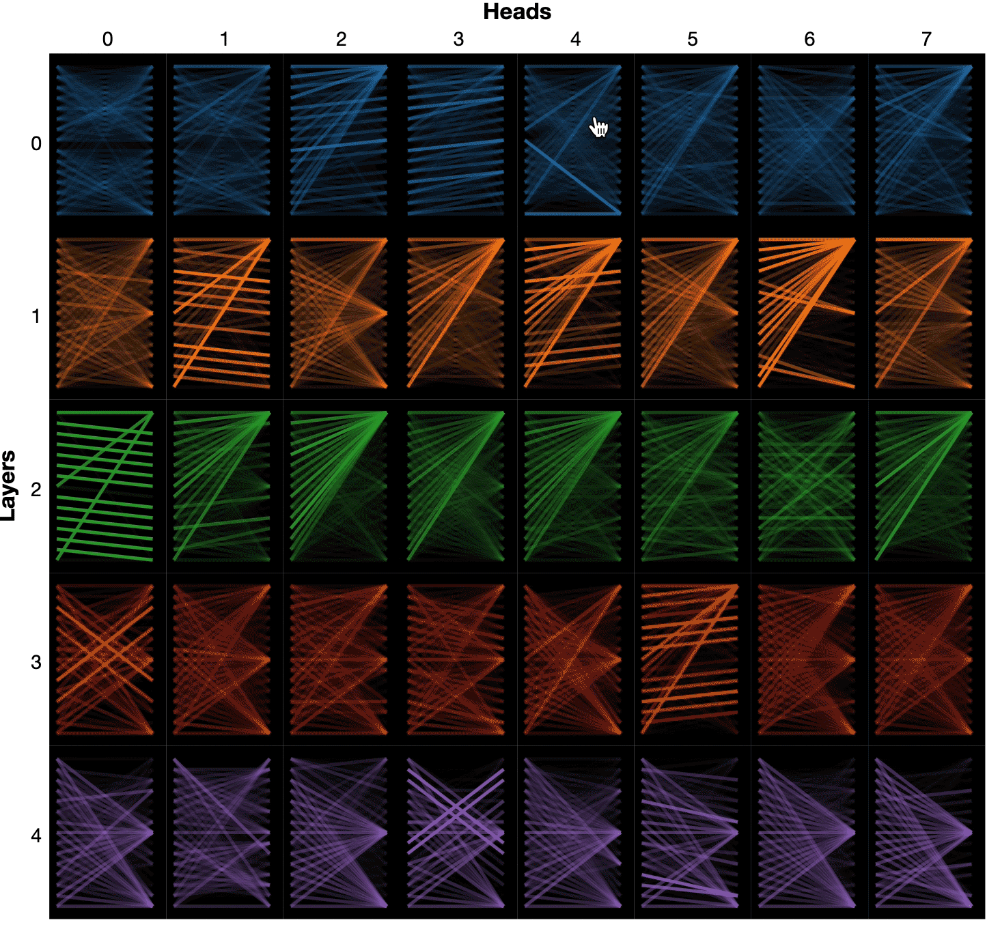

## TEMPLATE

_DESCRIPTION_

AUTHOR, DATE
[LINK1](#) /
[LINK2](#)

